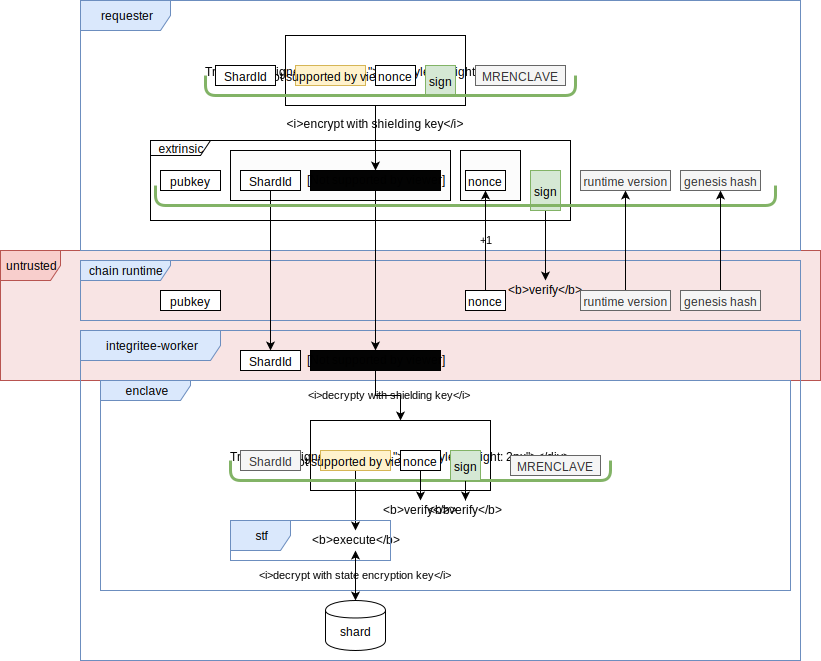
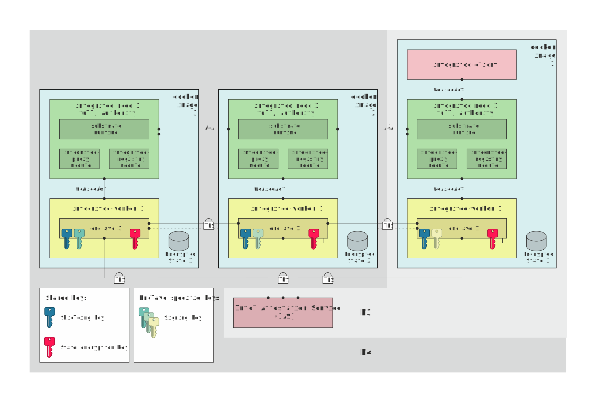

# Design

In the following we explain how Integritee works and how the different components play together.

## Direct Invocation (Vision)

*Integritee Target Architecture with Direct Invocation (future scenario)*

* Shielding key: used by the integritee-client to encrypt the call in order to protect caller privacy. It is common to all enclaves.
* State encryption key: used to encrypt and decrypt the state storage. It is common to all enclaves.
* Signing key: used to sign transactions for the integritee-node. The corresponding account must be funded in order to pay for chain fees. It is unique for every enclave.

### How it works

The *integritee-node* is a substrate blockchain node with an additional runtime module:

* integritee-registry module: proxies requests to workers, verifies IAS reports and keeps track of the registered enclaves. It provides the following API interfaces:
  * Register an enclave
  * Remove an enclave
  * Get the list of enclaves
  * invoke worker
  * confirm processing of requests

The *integritee-worker* checks on the first start-up if "his" enclave is already registered on the chain. If this is not the case, it requests a remote attestion from the Intel Attestation Service (IAS) and sends the report to the *teerex module* to register his enclave.

If there is already an enclave (belonging to a different integritee-worker) registered on the chain, the integritee-worker requests provisioning of secrets (the *shielding and state encryption private key*) from the already registered enclave. The exchange of critical information between the enclaves is performed over a secure connection (TLS). The two enclaves perform a mutual remote attestation before exchanging any secrets.

## Indirect Invocation (current implementation)

The high level architecture of the current implementation can be seen in the following diagram:

The main building blocks can be found in the following repositories:

* [integritee-node](https://github.com/integritee-network/integritee-node): (custom substrate node) A substrate node with a custom runtime module
* [integritee-worker](https://github.com/integritee-network/worker): (client, worker-app, worker-enclave): A SGX-enabled service that performs a confidential state-transition-function

### Request Lifetime end-to-end

## Redundancy (M3 onwards)

The goal of redundancy is to allow multiple workers to operate on the same state to be resilient against outage of one or more workers.

The high level architecture for M3 and M4 can be seen in the following diagram:

where M3 includes only the *docker image 1* and the *Intel Attestation Service (IAS)* and M4 includes the three *docker images* and the *Intel Attestation Service (IAS)*.
