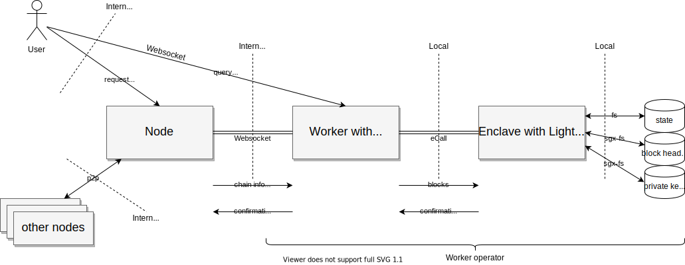

# Threat model of ChainRelay

## Introduction
A security threat model for the ChainRelay of Integritee.

The following points will be analysed:
* **S**poofing
* **T**ampering
* **R**epudiation
* **I**nformation disclosure
* **D**enial of service
* **E**levation of privileges

## System overview

## Actors

### User
User of the system that holds tokens either on-chain or in an incognito account.

* They use the integritee-cli
* They can send extrinsics/transactions to the node that will then be processed by the enclave
* They can query their own enclave state, the enclave public key and the mutual-remote-attestation port directly from a worker over WebSocket
* They hold their key pairs (for on-chain and incognito accounts)

### Worker operator
Operates the worker and the enclave.

* They use the integritee-service
* They have full access to the system (HW, OS and services)

### Vendor
Releases Integritee software

* They distribute SW binaries
* They can sign enclaves with MRSIGNER

There is no specific vendor in Integritee as it is open source code that can be deterministically built by anyone to reach an identical MRENCLAVE for the enclave. Therefore, each operator is also a vendor!

Because of this Integritee may not use MRSIGNER policy but MRENCLAVE for SGX sealed storage (known issue https://github.com/integritee-network/worker/issues/88)! This means that sealed storage can only be accessed by the very same untampered version of the enclave running on the same HW platform.

Software updates are not yet supported: https://github.com/integritee-network/worker/issues/85

## Analysis

| **Attack Category** | **Actor** | **Description** | **Mitigation** | **Assessment** |
|---|---|---|---|---|
| Impersonation | User | Get access to private keys of other users. | Protection of keys and key stores with passwords. WARNING: This is the responsibility of the developer building the client. Our example client does not include any mitigations. | delegated |
| Eclipsing | Operator or ISP | Expose the worker to a different (malicious) node | Rely on finality and read proofs with Light-Client| OK since M6 |
| Spoofing | Operator | Modify the enclave to perform malicious operations | Remote Attestation, TrustedCall signature payload includes MRENCLAVE | OK |
| Tampering | User | Replay TrustedCalls (i.e. repeat transactions of funds until account depleted) | Use of nonce in TrustedCall | [known issue](https://github.com/integritee-network/worker/issues/89) |
| Tampering | Operator | Tamper with the block header store of the Light-Client (roll back or modify) | Block header store is encrypted as SGX sealed storage Sync with chain upon startup Verify linked-hash-chain of block headers | OK |
| Tampering | Operator | Tamper with the state of the enclave | State is encrypted with the state-encryption-key, the private key stored in SGX sealed storage with MRENCLAVE policy | [known issue](https://github.com/integritee-network/worker/issues/88) |
| Tampering | Operator | Block confirmations from worker to node | Redundancy of workers | OK |
| Tampering | Operator | Modify worker-api response to TrustedGetter | Enclave signs responses | [known issue](https://github.com/integritee-network/worker/issues/91) |
| Repudiation | Operator | Deny WorkerApi access to certain users selectively | Redundancy of workers | OK |
| Information disclosure | Operator | Get information about contents of TrustedCalls | TrustedCalls are encrypted with public shielding key of the enclave (whose private key is stored in SGX sealed storage with MRENCLAVE policy) | [known issue](https://github.com/integritee-network/worker/issues/88) |
| Information disclosure | Operator | Get information about contents of TrustedGetters responses | Encrypt responses wss:// to WorkerApi into enclave | [known issue](https://github.com/integritee-network/worker/issues/91) |
| Information disclosure | Operator | Get meta information about TrustedCalls | Indirect invocation: need to use public account to proxy the TrustedCall through blockchain. Use fresh unlinkable accounts for each TrustedCall. Direct invocation: limited access to meta information (network layer only) | (delegated) [known issue](https://github.com/integritee-network/worker/issues/88) |
| Information disclosure | Operator | Know which incognito account belongs to whom | SGX confidentiality guarantees, encrypted TrustedCall and TrustedGetter with enclave shielding key | [known issue](https://github.com/integritee-network/worker/issues/88) |
| Information disclosure | Operator | Leak state information | SGX confidentiality guarantees, encrypted state with state-encryption-key MRENCLAVE policy for SGX sealed storage | [known issue](https://github.com/integritee-network/worker/issues/88) |
| Information disclosure | User | Get information about other accounts and users in the enclave | Authentication of TrustedGetter. User can only query own state | OK |
| Denial of service | Operator | Limit the resources of the worker or the enclave to slow down the system | Redundancy of workers | OK |
| Denial of service | User | Send invalid transactions to crash either the worker or the enclave | Ensure enclave code doesn't panic | OK to the best of our knowledge |
| Denial of service | User | Overload the system with spam (TrustedGetters or TrustedCalls) | TrustedCalls: cost of tx fees (indirect invocation), block size limit TrustedGetter: load balancing as needed (scale number of workers horizontally), standard DDoS mitigation | delegated
