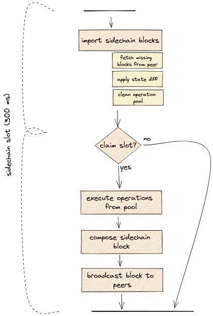
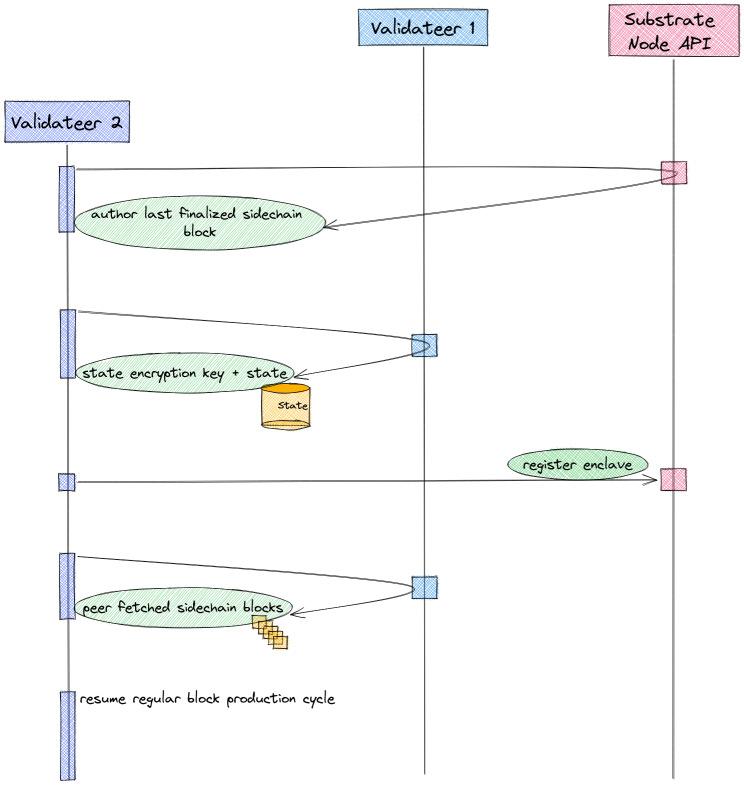

# Sidechain

## Introduction and terminology

This section explains what a sidechain is and how it can be used to enable a coordinated multi-validateer setup. First some clarification of terminology:

* **Validateer**: Combination of the two terms *validator* and *TEE*. A [validator](https://wiki.polkadot.network/docs/learn-validator) in [Polkadot](https://polkadot.network/) is an agent that produces blocks for the blockchain, and *TEE* is 'Trusted Execution Environment'. So, a validateer is an agent that produces blocks in a trusted execution environment. This represents a specialization of the more general Integritee 'worker', which does not necessarily incorporate a sidechain.
*  **Sidechain**: The sidechain is a blockchain collectively maintained by validateers (i.e. workers that produce sidechain blocks). In the context of Polkadot, this would be a layer 2 blockchain (0 being the relay chain, 1 the 'parent chain' or Parachain).
*  **Parentchain**: The layer 1 blockchain that is used by any Integritee worker (including the validateer). When run in the Polkadot ecosystem, this is the Parachain - otherwise it's a solo chain.

## Motivation

What are the applications of such a sidechain, what are its benefits? In short, the sidechain allows us to synchronize state transitions and updates across multiple validateers. 

Being a blockchain, the sidechain can guarantee the consistency, ordering of state transition executions, and traceability. We can decentralize a specific business logic and run it on many validateers independently while maintaining state consistency. A further benefit of running multiple validateers is scalability and load-balancing.

## Multi-validateer setup with sidechain

Validateers use their light-client and 'node API' to communicate with the parentchain, which is maintained by a substrate node.

## Block production

The block time of the parentchain is currently set to `12s`. The validateers themselves produce sidechain blocks in intervals of `300ms`. The block production and consensus algorithm used to produce sidechain blocks, is [AURA](https://docs.substrate.io/v3/advanced/consensus/#aura). This means we have a defined set of authorities (i.e. validateers) that take turns in producing blocks. Each validateer (or more general, Integritee worker) is registered to the parentchain, thus defining the set of authorities. Time is then partitioned into slots of `300ms` and each slot is assigned to a validateer in a round-robin fashion. As an example, with 3 validateers, each validateer will produce a sidechain block every third slot.

When a validateer produces a sidechain block, it broadcasts this new block to all of its peer validateers. How does it know its peers? As mentioned above, all validateers are registered on the parentchain. A validateer queries the parentchain to get the identities and URIs to communicate with all its peers.

#### Block production cycle

Depiction of the cycle each validateer runs for a slot. This is done in the `slot worker` component of a validateer. A cycle is triggered every `300ms`.

Explanation of the sequence:

1. First it processes the sidechain import queue. Sidechain blocks from the queue are imported until the queue is empty.
   - Importing a sidechain block results in applying the state diff and removing executed operations from the trusted operation pool.
   - It also includes potential fetching of sidechain blocks from a peer in case missing blocks were detected.
2. The next step is determining if the current slot should be claimed, meaning determining if it is this validateers turn to produce a block. If not, the slot cycle ends here.
3. In case the slot is claimed, a validateer starts executing trusted operations from the trusted operation pool until the allocated time limit is reached. 
   - The time limit is a configurable fraction of the slot time, currently set to 80%. 
   - The result of the trusted operations is a state diff which will be included in the sidechain block. With this information the sidechain block will be composed.
   - Once a sidechain block is composed, the validateer checks the slot time to ensure it's still within its claimed slot. If not, the block is discarded and the cycle ends. Otherwise, this new sidechain block is broadcasted to all peers, a parentchain extrinsic with confirmation of all executed operations composed and sent. 
  
**Note** on the slot time: At various points during the cycle the slot time is checked, to ensure the slot time of `300ms` is not exceeded. There are several cases where it still can happen. In order to prevent forks in the sidechain from happening, a sidechain block is only produced and broadcast when all the steps can be executed within the `300ms` time window. Otherwise it is discarded or not produced in the first place.

##### Scenarios where the slot time can be exceeded:
* **Block import stage**: The block import stage will import all the sidechain blocks it finds in the queue. This might also trigger a fetching of sidechain blocks from a peer when missing blocks are detected (further described in the on-boarding process). This whole process might take considerably longer than the slot time, but is necessary for further execution. If the time is exceeded here, the slot cycle will end after the import and be triggered again at the next point in time when a slot starts. This can potentially skip multiple slots including ones where this validateer should have produced a block. This is however not a problem, not producing a block during a slot does not endanger the integrity of the sidechain. And furthermore, the exceeding of the slot time because of block import should only happen in rare cases, e.g. during on-boarding or after being offline for period of time.
* **Trusted operation execution**: Slot time is checked after each trusted operation execution. Only a defined fraction of the slot time is allocated for trusted operation execution. It can happen however, that the last operation that is executed takes too long and exceeds the allocated slot time fraction. In that case no block will be produced.

### Validateer components

Let's have a brief, high-level look at the main components inside a validateer for the sidechain block production.

The validateer component is split into two regions, untrusted and trusted. The trusted region is everything inside the enclave (TEE) and what is exclusively accessible by the enclave, such as the state. Both the trusted and untrusted regions have an RPC interface. The trusted RPC interface is used to send direct invocation calls, which are then added to the trusted operation pool. The trusted RPC interface is also used when we broadcast sidechain blocks. This then internally fills the sidechain block import queue. 

The `slot worker` component runs for every slot, imports sidechain blocks, executes trusted operations, and updates the state, as described in the chapter above. On the untrusted side we have a store for sidechain blocks, where we cache the last `100` blocks. This can be done on the untrusted side because sidechain blocks are signed, and any tampering could be noticed by verifying the signature. This store allows us to provide an RPC interface from which sidechain blocks can be fetched. This is relevant for the on-boarding process of new validateers which will be explained later.

## On-boarding of new validateers

On-boarding is the process that happens when a new validateer is started and joins the set of validateers that have already been producing sidechain blocks for some time. On-boarding allows a new validateer to catch up on state and sidechain blocks to then start producing sidechain blocks itself.

### Sequence diagram of on-boarding a new validateer

In this scenario, validateer 1 has been producing sidechain blocks for some time and is then joined by validateer 2. the following diagram illustrates the sequence from the point of view of validateer 2 undergoing the on-boarding process.

1. On-boarding starts off with determining if there are other running validateers that have produced sidechain blocks. This is done by querying the parentchain about the author of the last sidechain block. As a result validateer 2 learns about the identity and URI of validateer 1.
   - Note that in case there is no previous sidechain block and therefore no author, a validateer concludes that it's the first (or `primary`) validateer.
1. Validateer 2 then uses this information to fetch the state encryption key and state from this peer (validateer 1).
1. Once this is done, validateer 2 registers itself to the parentchain and becomes part of the active (i.e. block producing) validateer set.
1. Upon running the first slot cycle and importing sidechain blocks from the queue, validateer 2 notices it's missing sidechain blocks. Again it communicates with its peer, validateer 1, to directly fetch these missing blocks. As explained above, validateer 1 stores a certain amount of sidechain blocks in a database. Once these peer-fetched blocks are transferred and imported, the importing from the regular import queue resumes. 
1. And with that, validateer 2 is fully synced and can continue with the regular block production cycle, producing blocks itself now, every second slot.

#### Relationship between 'state' and sidechain blocks

In the on-boarding process, both 'state' and sidechain blocks are transferred from one validateer to another. What is the difference and why are both required? In theory, all state information is contained in the sidechain blocks. In order to know what the current state is, all transactions/operations in the sidechain blocks from genesis can be computed and accumulated. This however means that computing the current state becomes more time consuming as the blockchain grows. That is where the 'state' comes into play. The 'state' is a snapshot of the blockchain at a certain time (or block number). For example in a blockchain with `100` blocks, a state snapshot might be taken at block number `95`. So in order to know the latest state (at block number `100`), the state snapshot is taken and the last `5` blocks are applied to this state. This dramatically reduces the amount of computation required to arrive at the latest state.

In the current configuration, a sidechain state snapshot is taken after each sidechain block. So why do we need to transfer the state and then still fetch missing sidechain blocks? Because in between the time of fetching the state snapshot and starting the sidechain block production cycle, more sidechain blocks were already produced. Furthermore, only a certain number (currently `100`) of sidechain blocks are cached in each validateer. This cache size has to be large enough to bridge the gap between receiving the state snapshot and starting the block production cycle. A cache size of `100` blocks and a block production time of `300ms` means that a gap of maximum `30s` can be bridged, which imposes an upper limit to the duration of the on-boarding process.

## How-To Guide

[This](./howto_sidechain_multivalidateer.md) how-to guide explains how to set up multiple validateers with a substrate node and then execute the sidechain demo script.

## Youtube Demo

A screen cast of the sidechain demo is available on Youtube, [here](https://www.youtube.com/watch?v=HBH8R0RJ1mY), where some of the aspects mentioned above are explained in more detail using the sidechain demo script and the resulting log output.