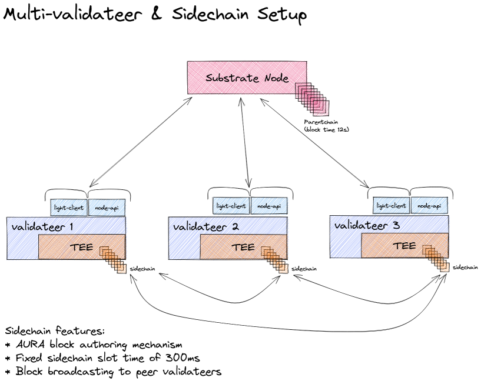
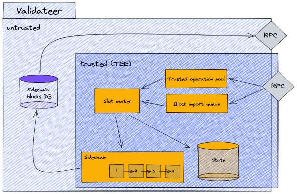

# Sidechain - Multi-validateer setup

## Introduction and terminology

This section explains what a sidechain is and how it can be used to enable a coordinated multi-validateer setup. First some clarification of terminology:

* **Validateer**: Combination of the two terms *validator* and *TEE*. A [validator](https://wiki.polkadot.network/docs/learn-validator) in [Polkadot](https://polkadot.network/) is an agent that produces blocks for the blockchain, and *TEE* is 'Trusted Execution Environment'. So, a validateer is an agent that produces blocks in our trusted execution environment. This represents a specialization of the more general 'worker', which does not necessarily incorporate a sidechain.
*  **Sidechain**: The sidechain is a blockchain maintained by and among validateers (i.e. workers that produce sidechain blocks). In the context of Polkadot, this would be a layer 2 blockchain (0 being the relay chain, 1 the 'parent chain').
*  **Parentchain**: The layer 1 blockchain that is used by any Integritee worker (including the validateer). When run in the Polkadot ecosystem, this is the Parachain - otherwise it's a solo chain.

## Motivation

What are the applications of such a sidechain, what are its benefits? In short, the sidechain allows us to synchronize state transitions and updates across multiple validateers. 

Being a blockchain, the sidechain can guarantee the consistency, ordering of state transition executions, and traceability. We can decentralize a specific business logic and run it on many validateers independently while maintaining state consistency.

## Multi-validateer sidechain setup overview

Validateers use their light-client and 'node API' to communicate with the parentchain, which is maintained by a substrate node.

### Block production

The block time of the parentchain is currently set to `12s`. The validateers themselves produce sidechain blocks in intervals of `300ms`. The block production and consensus algorithm used to produce sidechain blocks, is [AURA](https://docs.substrate.io/v3/advanced/consensus/#aura). This means we have a defined set of authorities (i.e. validateers) that take turns in producing blocks. Each validateer (or more general, Integritee worker) is registered to the parentchain, thus defining the set of authorities. Time is then partitioned into slots of `300ms` and each slot is assigned to a validateer in a round-robin fashion. As an example, with 3 validateers, each validateer will produce a sidechain block every third slot.

When a validateer produces a sidechain block, it broadcasts this new block to all of its peer validateers. How does it know its peers? As mentioned above, all validateers are registered on the parentchain. A validateer queries the parentchain to get the identities and URIs to communicate with all its peers.

### Validateer components

Let's have a brief, high-level look at the main components inside a validateer for the sidechain block production.

The validateer component is split into two regions, untrusted and trusted. The trusted region is everything inside the enclave (TEE) and what is exclusively accessible by the enclave, such as the state. Both the trusted and untrusted regions have an RPC interface. The trusted RPC interface is used to send direct invocation calls, which are then added to the trusted operation pool. The trusted RPC interface is also used when we broadcast sidechain blocks. This then internally fills the sidechain block import queue. The `slot worker` component runs for every slot, imports sidechain blocks, executes trusted operations, and updates the state. This will be explained in more detail later. On the untrusted side we have a store for sidechain blocks, where we cache the last `100` blocks. This can be done on the untrusted side because sidechain blocks are signed, and any tampering could be noticed by verifying the signature. This store allows us to provide an RPC interface from which sidechain blocks can be fetched. This is relevant for the on-boarding process of new validateers which will be explained later.

## How-To Guide

[This](./howto_sidechain_multivalidateer.md) how-to guide explains how to set up multiple validateers with a substrate node and then execute the sidechain demo script.

## Youtube Demo

A screen cast of the sidechain demo is available on Youtube, [here](https://www.youtube.com/watch?v=HBH8R0RJ1mY), where some of the aspects mentioned above are explained in more detail using the sidechain demo script and the resulting log output.