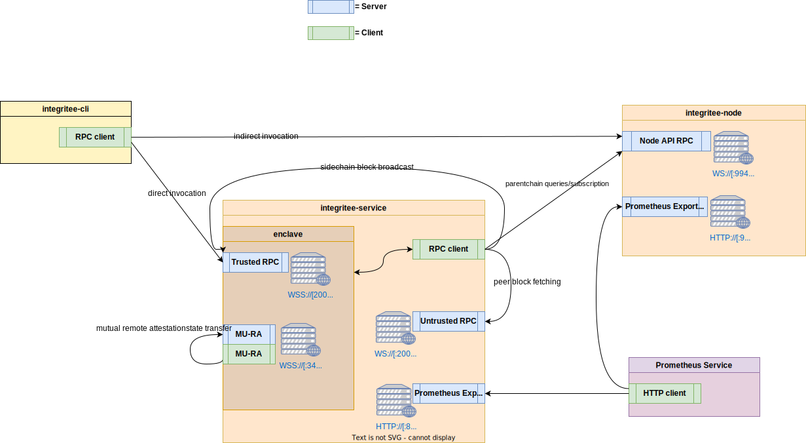
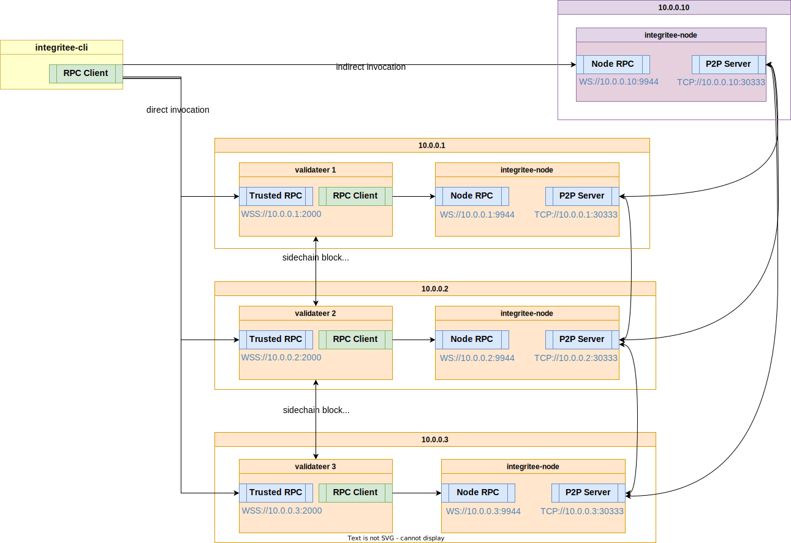

# Sidechain system and networking overview

Diagram showing the system and networking overview of the integritee systems:
* **integritee-service** : The core Integritee service, hosting the TEE (enclave). Called `validateer` in case sidechain blocks are produced
* **integritee-node** : Substrate node for the layer 1 (aka parent) blockchain
* **integritee-cli** : Command-line interface client to interact with both the **Integritee-service** and the **integritee-node**   

Server ports in the diagram are default values. They can also be set explicitly by command line arguments.

The **Prometheus Service** is an external monitoring service, scraping metrics from the **integritee-service** and **integritee-node**.

The **integritee-service** communicates among instances of itself. The following use-cases rely on this peer-to-peer communication:
* Mutual remote attestation (MU-RA), uses TLS secured websocket connection
* Sidechain block broadcasting, receiving end is an secure websocket server on the trusted side (enclave)
* Sidechain block fetching for on-boarding (provided by untrusted sidechain block storage)

The **integritee-cli** uses RPC to communicate with both the **integritee-node**, for parentchain state queries and indirect invocation, and the **integritee-service**, for direct invocation and sidechain state queries.

## Networking example for a multi-validateer setup with local nodes

The following diagram depicts a multi-validateer setup with `integritee-nodes` running locally (i.e. on the same machine or container as the validateer itself). The `integritee-nodes` maintain the parentchain, the validateers the sidechain. Both blockchains use peer-to-peer communication to exchange blocks on their respective blockchain. A client like the `integritee-cli` can send extrinsics to any `integritee-node` (indirect invocation). The diagram shows the case of one that is running independently of any validateers. Or it can send an extrinsic directly to a validateer, using its RPC interface (direct invocation), again it does not matter which one, they are all synchronized.

