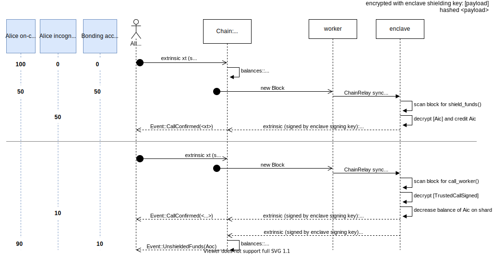

# Token Shielding

Token shielding is the process of transferring on-chain tokens (where they are transferred transparently) to off-chain STF (where transactions are private). The on-chain tokens are kept in enclave custody on a bonding account until unshielded again.

Unshielding is the reverse process, where off-chain funds are transferred to on-chain accounts. The bonding account then releases these funds on behalf of the owner's public account.

